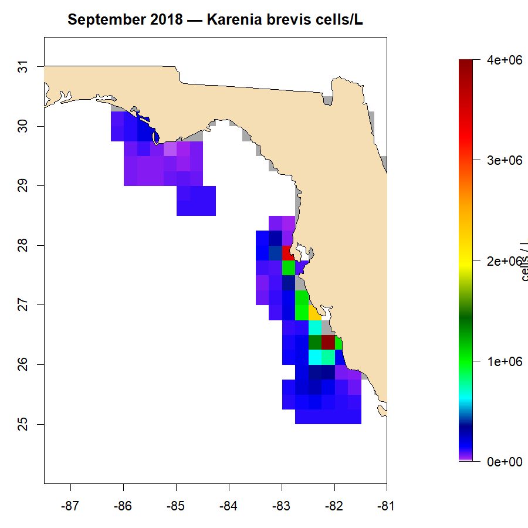

# RedTideMaps

Monthly red-tide severity rasters for the West Florida Shelf, as input to the **WFS Ecospace** model ([Vilas et al. 2023](https://www.nature.com/articles/s41598-023-29327-z)).

This repository produces monthly maps of *Karenia brevis* cell concentrations (cells / L) across a configurable spatial grid, by combining FWC in-situ cell counts, satellite-derived bloom polygons (VIIRS, MODIS nFLH), and species-distribution modeling with [sdmTMB](https://pbs-assess.github.io/sdmTMB/). Output is one ASCII raster per month, ready to be loaded as a spatial driver in **Ecopath with Ecosim / Ecospace**.

Developed as part of the *Operationalizing the West Florida Shelf ecosystem model and application to red tides, stock assessment, and catch advice for Gulf of Mexico reef fish* project (PI: David Chagaris).



*Example: predicted cells / L for September 2018, during the major K. brevis bloom on the West Florida Shelf.*

---

## Pipeline

```
                ArcGIS REST                                          Ecospace
   FWC HAB  ─────────────►  cell_counts/                             ST drivers
                              │                                          ▲
                              ▼                                          │ (opt)
                       spatial filter ──────► filtered HAB               │
                              │                                          │
                              ▼                                          │
                       sdmTMB monthly fits ──► pred_array                │
                              │                                          │
                              ▼                                          │
                      predict to grid ───────► sdmTMB_log_stack          │
                              │                                          │
                              ▼                                          │
   VIIRS tifs  ─┐                                                        │
   MODIS polys ─┼──► clip cascade (VIIRS > MODIS > buffered hulls)       │
   buffered    ─┘            │                                           │
   hulls                     ▼                                           │
                       combined stack ──────► monthly ASCII ─────────────┘
```

Each step is one function in `scripts/`:

| Step | Function | File |
|---|---|---|
| Pull FWC HAB samples | `fn.get_fwc_data` | `get_HAB_data.R` |
| Spatially filter to the WFS grid | `fn.filter_hab_data` | `get_HAB_data.R` |
| Build prediction grid | `fn.make_input_grid` | `sdmTMB_HAB_data.R` |
| Fit monthly sdmTMB models | `fn.fit_monthly_sdmTMB` | `sdmTMB_HAB_data.R` |
| Predict to grid | `fn.predict_monthly_sdmTMB` | `sdmTMB_HAB_data.R` |
| Buffered concave hulls | `fn.buffered_hulls` | `polygon_clipping_rt.R` |
| Clip predictions to hulls | `fn.clip_2_hulls` | `polygon_clipping_rt.R` |
| Stack VIIRS tifs | `fn.viirs_tifs2stack` | `process_VIIRS.R` |
| Clip predictions to VIIRS | `fn.clip_2_viirs` | `process_VIIRS.R` |
| Clip predictions to MODIS nFLH | `fn.clip_2_modis` | `process_MODIS.R` |
| Combine + write ASCII | `make_redtide_ascii` | `polygon_clipping_rt.R` |
| Copy to Ecospace drivers (opt-in) | `export_to_ecospace` | `polygon_clipping_rt.R` |

## Why the clipping cascade

Predicted cell concentrations from sdmTMB can extend across the entire shelf even when no bloom is actually present. The clipping step restricts the prediction to the actual bloom footprint for that month:

- **VIIRS (2012–present)** — NOAA monthly red-tide probability rasters (0.1°). Where any cell is > 0, the prediction in that month is masked to those cells. This is the highest-confidence source.  These maps are developed by the [University of South Florida Optical Oceanography Laboratory](https://optics.marine.usf.edu/). See [Yao et al. (2023)](https://doi.org/10.1016/j.rse.2023.113833) and [Hu et al. (2015)](https://doi.org/10.3390/s150202873) for details.
- **MODIS nFLH (2003–2025)** — Normalized fluorescence-line-height rasters thresholded at ≥ 0.02 mW cm⁻² μm⁻¹ sr⁻¹ (per [Hu et al. 2005](https://doi.org/10.1016/j.rse.2005.05.013), updated calibration via Chuanmin Hu, pers. comm.) are dissolved into polygons used as the clipping mask when VIIRS is unavailable.
- **Buffered concave hulls (all years, fallback)** — For months with no satellite coverage, a 10 km buffered concave hull around positive in-situ observations defines the bloom footprint. k-means splits multi-cluster months into separate hulls.

For each (year, month), the combined stack picks **VIIRS if available**, otherwise **MODIS**, otherwise **the buffered-hull-clipped prediction**. The decision per month is logged to `out/<res>min/clipped/clipping_source.csv`.

## Quick start

Requires **R ≥ 4.5** with the packages listed in [Reproducibility](#reproducibility).

```bash
git clone https://github.com/WFS-FEM/RedTideMaps.git
cd RedTideMaps
Rscript run_redtide_maps.R
```

The script finds the repo root itself: run it from the repo folder, open `RedTideMaps.Rproj` in RStudio and source it, or give `Rscript` the full path to `run_redtide_maps.R` from anywhere.

No paths need editing for a basic run. Machine-specific settings, such as the Ecospace export folder, go in a local `config.local.R`, which is gitignored:

```bash
cp config.local.example.R config.local.R   # then uncomment what you need
```

The first run takes about 20 minutes at the default 5-min resolution. It will:
1. Pull the full FWC HAB record from the ArcGIS REST endpoints (~3 min, ~216k records).
2. Filter to the WFS grid.
3. Fit monthly sdmTMB models for every (year, month) with more than 5 positive observations (~7 min).
4. Predict to the depth template grid.
5. Run the clipping cascade.
6. Write 12 ASCII files per year to `out/<res>min/ecospace_ascii/`.

## Monthly rerun

There is nothing to download by hand: the FWC records come from the ArcGIS REST API. (Older versions of this workflow asked for the "Recent HAB" CSV to be downloaded into `cell_counts/`. Don't do that now; `cell_counts/` holds only the merged file the script writes itself.)

1. Run the workflow:

   ```bash
   Rscript run_redtide_maps.R
   ```

2. Check that the run log, `out/<res>min/run_<yyyymmdd>.log`, ends with `Run complete.`
3. Commit the updated deliverables, `out/<res>min/ecospace_ascii/` and `out/<res>min/plots/`.

If `export_ecospace` is on in `config.local.R`, step 1 also copies the ASCII files to the Ecospace ST drivers folder.

Each rerun:

- Pulls the FWC records dated on or after the latest `SAMPLE_DATE` already in the local merged CSV, from the `Recent_` endpoint only.
- Refits only the (year, month) combinations that don't already have a fit on disk (incremental cache).
- Re-runs predict, hull, VIIRS, MODIS clip and ASCII for the full year range.

A monthly rerun takes about 9 minutes at 5-min resolution (measured: 8 min 50 s, with 0 months to refit), against about 19 minutes for a first run. Most of that is fixed: steps 2–6 re-filter, re-predict from the cached fits, re-clip and rewrite every month since `styr`, however few records are new. The toggles change it:

| Toggle | Effect on a rerun |
|---|---|
| `fwc_force_full = TRUE` | +~3 min (full FWC pull) |
| `incremental_fit = FALSE` | +~6 min (refits every month) |
| `fit_nb = TRUE` | Roughly doubles fitting time for months that are (re)fit |
| `update_modis = TRUE` | Adds an ERDDAP download; the first one pulls everything since 2002 because the raw MODIS stack is not tracked |
| `export_ecospace = TRUE` | Seconds |

Each month that does need a new fit adds about a second.

**Known limits of the incremental rerun** (to be addressed):

- Records FWC adds or corrects with a `SAMPLE_DATE` earlier than the local latest date are not picked up. To catch them, set `cfg$fwc_force_full <- TRUE` in `config.local.R` for one run (a full pull takes ~3 min).
- A month that already has a fit is not refit when new data for it arrives. Delete its fit folder to force a refit (below).

**To force a refit of a specific month** (e.g., after data corrections):

```bash
rm -rf out/5min/sdm/OM_month/202503
Rscript run_redtide_maps.R
```

**To push the ASCII drop to the Ecospace ST drivers folder**, set `cfg$ecospace_root` and `cfg$export_ecospace <- TRUE` in `config.local.R`. The destination `<ecospace_root>/<res>min/red tide/sdmTMB/` must already exist; the run checks it before doing any work and stops if it is missing.

## Configuration

All knobs live in the `cfg` list at the top of `run_redtide_maps.R`. To change one on your machine only, set it in `config.local.R` (e.g. `cfg$res <- 15L`) rather than editing the driver:

| Key | Default | Purpose |
|---|---|---|
| `res` | `5L` | Output resolution in minutes. Supported: 5, 15 (templates shipped in `template rasters/`). |
| `styr`, `enyr` | `1985`, current year | Year range to model. |
| `repo_dir` | detected automatically | Repo root: the working directory if it holds `RedTideMaps.Rproj`, otherwise the folder `Rscript` was pointed at. |
| `proj_dir` | `repo_dir` | Where inputs and outputs live. Override if data is outside the repo. |
| `bathy_dir` | `<repo>/template rasters` | Where the depth + excl ASCII templates live. |
| `ecospace_root` | `NULL` (set in `config.local.R`) | Ecospace "ST drivers" root, the target for `export_to_ecospace()`. |
| `use_viirs` | `TRUE` | Include VIIRS clipping. |
| `use_modis` | `TRUE` | Include MODIS nFLH clipping (requires shipped FLH polys). |
| `update_modis` | `FALSE` | Pull/update raw MODIS FLH from ERDDAP before clipping. Needs network. |
| `rebuild_nflh` | `FALSE` | Rebuild FLH polygons from raw stack. Set with `update_modis`. |
| `fwc_force_full` | `FALSE` | Ignore the local FWC CSV cache and pull every endpoint again. |
| `incremental_fit` | `TRUE` | Skip months that already have a fit on disk. Delete `OM_month/<yyyymm>/` to force a refit. |
| `fit_nb` | `FALSE` | Also fit the NB2 spatial model in addition to lognormal. Only lognormal is used downstream, so leaving this `FALSE` roughly halves cold-run fit time. |
| `export_ecospace` | `FALSE` | After the run, copy `ecospace_ascii/` into `<ecospace_root>/<res>min/red tide/sdmTMB/`. |

## Inputs

**Tracked in the repo** (run from a fresh clone works without any external paths):

- `VIIRS/redtide_maps_0.1degree/*.tif` — NOAA monthly red-tide probability rasters (2012-present).
- `MODIS/FLH polys *.Rdata` — pre-built nFLH-threshold polygons (2002-present).
- `template rasters/depth *.asc`, `excl layer *.asc` — depth + exclusion templates for 4, 5, 6, 10, and 15-minute resolutions.
- `data/FWC HAB API query urls.txt` — list of 6 FWC ArcGIS REST endpoints.

**Pulled fresh from the FWC ArcGIS REST API at every run** (not committed):

- `cell_counts/FWC HAB data <yyyymmdd>-<yyyymmdd>.{csv,Rdata}` — merged in-situ K. brevis cell counts from FWC.

## Outputs

```
out/<res>min/
  sdm/
    *_filtered.Rdata        # spatially filtered HAB observations
    OM_month/<yyyymm>/      # per-month sdmTMB fits (fit_sdmTMBlog.RData [+ fit_sdmTMBnb.RData])
    pred_SDMs_RT.RData      # 4-D pred_array (cell × model × month × year)
    RT_fit_matrix.RData     # convergence + RRMSE/MAE/AIC per (year, month, model)
    pred_obs_RT.RData       # observation-vs-prediction pairs
    fit_warnings.csv        # captured sdmTMB warnings with (year, month, model) context
    sdmTMB_log_stack_*.grd  # monthly prediction stack (cells/L)
    *_hullpolys.Rdata       # per-month buffered concave hulls
  clipped/
    *_clipped_hull.grd      # predictions masked to buffered hulls
    *_clipped_viirs.grd     # predictions masked to VIIRS positive cells
    *_clipped_modis.grd     # predictions masked to MODIS nFLH polygons
    clipping_source.csv     # per-month decision: VIIRS / MODIS / hull
  combined/
    *_clipped_combined.grd  # final merged stack (VIIRS > MODIS > hull)
  ecospace_ascii/
    sdmTMB_log__<yyyymm>.asc  # one ASCII per month — the deliverable
  plots/
    sample locations by year.png
    N samples over time.png
    sdmTMB log maps.pdf
    *_clipped_combined.pdf
```

Each run regenerates the contents. Only the deliverables, `ecospace_ascii/` and `plots/`, are tracked in git; the intermediates (`sdm/`, `clipped/`, `combined/`, run logs) are gitignored.

## Reproducibility

Tested with **R 4.5.1** on Windows 11.

Required packages (CRAN unless noted): `sf`, `raster`, `terra`, `rnaturalearth`, `rnaturalearthdata`, `sdmTMB`, `lubridate`, `concaveman`, `cluster`, `ggplot2`, `viridis`, `scales`, `cowplot`, `ggh4x`, `maps`, `fields`, `rvest`, `httr`, `jsonlite`. The run checks for these first and, if any are missing, stops with the `install.packages()` line to fix it.

Optional (only for `update_modis = TRUE`): `rerddap`, `curl`, `data.table`, `rasterVis`, `colorRamps`.

Install with:

```r
install.packages(c(
  "sf","raster","terra","rnaturalearth","rnaturalearthdata","sdmTMB","lubridate",
  "concaveman","cluster","ggplot2","viridis","scales","cowplot",
  "ggh4x","maps","fields","rvest","httr","jsonlite"))
```

`sdmTMB` is version-sensitive (depends on TMB); if you hit fit/predict issues, check the installed `sdmTMB` version matches the model object stored in `OM_month/`. A safe move is to delete the affected month's `OM_month/<yyyymm>/` folder and let the next run refit under the current version.

## Authors

- [David Chagaris](https://github.com/dchagaris) — PI, workflow design
- [Daniel Vilas](https://github.com/danielvilasgonzalez) — original sdmTMB and clipping code
- [Holden Harris](https://github.com/holden-harris) — operationalization

## License

MIT — see [LICENSE](LICENSE).
